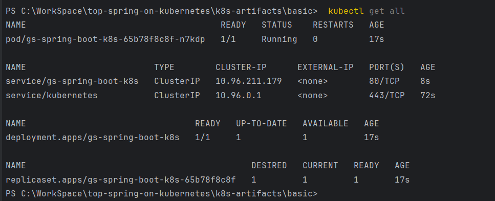

# Spring Boot Application trên Kubernetes

Dự án này là một ví dụ về cách triển khai ứng dụng Spring Boot lên Kubernetes, được xây dựng dựa trên hướng dẫn chính thức của Spring. Dự án bao gồm hai service chính:

1. `hello-service`: Service cung cấp API REST cơ bản trả về lời chào "Hello World"
2. `hello-caller`: Service gọi API từ hello-service để minh họa cách service discovery hoạt động trong môi trường Kubernetes

## Yêu cầu hệ thống

- Docker Desktop (cung cấp cả Docker và Kubernetes)
- Kubernetes CLI (kubectl)
- Maven
- JDK 17 trở lên

## Cấu trúc dự án

```
top-spring-on-kubernetes/
├── hello-caller/           # Service gọi API
│   ├── src/               # Source code
│   ├── k8s/               # Kubernetes manifests
│   └── pom.xml           # Maven configuration
└── hello-service/         # Service cung cấp API
    ├── src/               # Source code
    ├── k8s/               # Kubernetes manifests
    └── pom.xml           # Maven configuration
```

## Hướng dẫn chạy

### 1. Build Docker Image

Build image cho hello-service:
```bash
cd hello-service
./mvnw spring-boot:build-image -Dspring-boot.build-image.imageName=hello-service:latest
```

Build image cho hello-caller:
```bash
cd hello-caller
./mvnw spring-boot:build-image -Dspring-boot.build-image.imageName=hello-caller:latest
```

### 2. Kiểm tra Docker Image

```bash
docker images | grep hello
```

### 3. Triển khai lên Kubernetes

Triển khai hello-service:
```bash
kubectl apply -f hello-service/k8s/
```

Triển khai hello-caller:
```bash
kubectl apply -f hello-caller/k8s/
```

### 4. Kiểm tra trạng thái

```bash
kubectl get all
```

### 5. Truy cập ứng dụng

Để truy cập hello-caller service từ bên ngoài cluster:
```bash
kubectl port-forward svc/hello-caller 8080:8080
```

Sau đó truy cập: http://localhost:8080/call-hello

## Demo

### 1. Build Docker Image


### 2. Kiểm tra các resource trên Kubernetes


### 3. Kết quả chạy ứng dụng


## API Endpoints

### Hello Service
- GET `/hello`: Trả về lời chào từ service
- GET `/actuator/health`: Kiểm tra trạng thái sức khỏe của service

### Hello Caller
- GET `/call-hello`: Gọi API từ hello-service và trả về kết quả

## Best Practices đã áp dụng

1. Sử dụng Cloud Native Buildpacks để tạo Docker image
2. Cấu hình readiness và liveness probes
3. Sử dụng Kubernetes ConfigMaps cho cấu hình
4. Service discovery trong Kubernetes cluster
5. Graceful shutdown

## Công nghệ sử dụng

- Spring Boot
- Docker
- Kubernetes
- Maven
- Java 17
- Cloud Native Buildpacks
